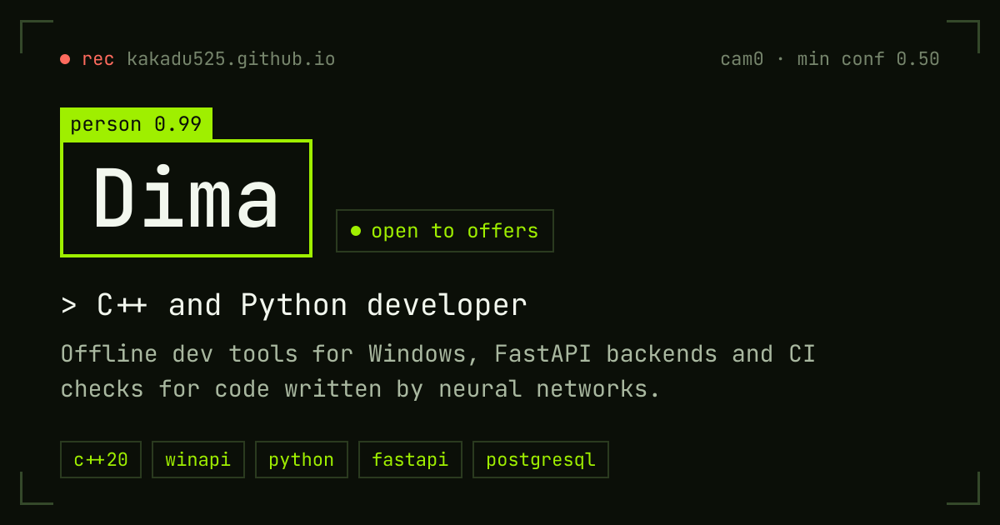

  
  
  
  

<b>Open to offers</b> · Voronezh, UTC+3

## About

I study Information Systems and Technologies and write two kinds of software. On Windows it's desktop tools in modern C++ with WinAPI and WebView2. On the server it's async Python with FastAPI and PostgreSQL. Lately I've been building checks for code written by neural networks, and I write about that on Habr.

Right now I'm learning Docker, SQL, system design and computer vision.

По-русски

Учусь на направлении «Информационные системы и технологии». Пишу десктоп на C++ и WinAPI, бэкенды на FastAPI и PostgreSQL, а ещё инструменты, которые проверяют код от нейросетей. Рассказываю об этом на Хабре. Сейчас в поиске интересных предложений. Подробнее на [kakadu525.github.io](https://kakadu525.github.io/).

## Stack

  

## Projects

### [confidence-scorer](https://github.com/Kakadu525/confidence-scorer)

A merge gate for pull requests written by AI. Every changed function runs in its old and new version on the same generated inputs, two models review the diff, and the result is a score from 0 to 100 with a verdict: merge, review, or don't merge.

In the demo an "AI simplification" drops a `percent < 0` check. The differential test finds `percent = -0.5`: the old code raised `ValueError`, the new one returns `0.0`. Score 35/100, merge blocked.

  

- Old and new versions of each changed function run on the same random and edge-case inputs (Hypothesis for Python, fast-check for JS and TS)
- A confirmed counterexample caps the score, whatever the AI reviewers say
- Works with Anthropic, OpenAI, DeepSeek, Qwen, free OpenRouter models or a fully local Ollama

### [Dev Toolbox](https://github.com/Kakadu525/dev-toolbox)

19 everyday developer utilities in one portable `.exe` for Windows. It needs no installation, no admin rights and no internet, so tokens and production logs never leave your machine.

  

- JSON, XML, YAML and SQL formatters, JWT decoder, regex tester, diff viewer
- HTTP client, cURL builder, hashes, Base64, UUID and QR codes, cron parser
- Process explorer, live-tail log viewer, clipboard history; English and Russian UI, dark and light themes

### [Wallet API](https://github.com/Kakadu525/wallet-api)

<table>
<tr>
<td width="260">

</td>
<td>

An async REST API for wallet balances on FastAPI and PostgreSQL. A retried request with the same key never charges twice.

- Each balance change is one atomic `UPDATE`; a test fires 20+ parallel requests at one wallet and the total still adds up to the cent
- `Idempotency-Key` with a unique constraint, plus an append-only transaction log written in the same transaction
- Token auth stores only a SHA-256 hash; someone else's wallet returns `404`, not `403`
- Prometheus metrics, Alembic migrations, pytest against a real PostgreSQL, a web panel at `/ui`

</td>
</tr>
</table>

### Also

- [**kakadu525.github.io**](https://github.com/Kakadu525/Kakadu525.github.io): this portfolio as a site, with a live object-detector scene. Astro, rebuilt daily to pick up new Habr articles.

## Writing

<!-- ARTICLES:START -->
- [Первый иск за «сбежавших» ИИ-агентов: кто отвечает, если агент сам взломал чужую систему](https://habr.com/ru/articles/1089530/) 2 Oct 2026 · 7 min read
- [Нейросеть написала PR, тесты зелёные, а поведение изменилось. Как я научил CI это ловить](https://habr.com/ru/articles/1088564/) 30 Sep 2026 · 12 min read
<!-- ARTICLES:END -->

[All articles on Habr →](https://habr.com/ru/users/MedSurg/publications/articles/)

## Activity

  <picture>
    <source media="(prefers-color-scheme: dark)" srcset="https://github-readme-stats-git-master-rickstaa.vercel.app/api?username=Kakadu525&show_icons=true&hide_border=true&theme=github_dark" />
    
  </picture>
  <picture>
    <source media="(prefers-color-scheme: dark)" srcset="https://github-readme-stats-git-master-rickstaa.vercel.app/api/top-langs/?username=Kakadu525&layout=compact&hide_border=true&theme=github_dark" />
    
  </picture>

  <picture>
    <source media="(prefers-color-scheme: dark)" srcset="https://streak-stats.demolab.com/?user=Kakadu525&hide_border=true&theme=github-dark" />
    
  </picture>

  <picture>
    <source media="(prefers-color-scheme: dark)" srcset="https://activity-graph.vercel.app/graph?username=Kakadu525&hide_border=true&theme=github-dark" />
    
  </picture>

## Now

- Looking for interesting offers
- Learning Docker, SQL and system design
- Getting into computer vision

The fastest way to reach me is [Telegram](https://t.me/medvedevds00). Email works too: [medvedka.dima@yandex.ru](mailto:medvedka.dima@yandex.ru).
